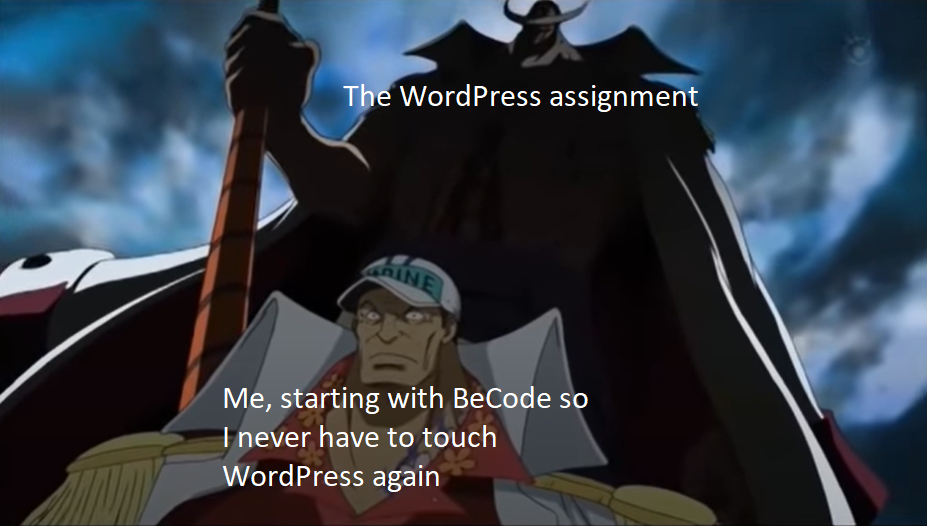

# Wordpress, My Sworn Arch-Nemesis
This assignment, we will learn how to work with Wordpress.
We need to create our very own website, and use our CSS and HTML knowledge to change the stuff a non-developer wouldn't know how to change.
I already have some prior experience with Wordpress (and Wix, unfortunately), so I think I'll do a fine job of this assignment.

A friend of my dad has also contacted me earlier because he wanted a website for his business.
So after I got the 'okeliedokeldie' for the Coaches, I decided to create a website for his business for this assignment.
Talk about befriending two birds with one worm (if that's how the saying goes)!

## Story Time
Funnily enough, Wordpress is the reason why I got into Web Development.
I had to make some websites for my old job, and for some friends and family.
And then I learned just how much I like making websites, and how much I hate how I have close to 0 creative freedom with Wordpress.
That was before I knew how to work with CSS and the like, of course.

So when I heard we had to make a Wordpress website, I immediately made a meme about it.

All in all, I am looking forward to see just how much I have improved since I made my first website.
And how much more freedom I have obtained in Wordpress now that I'm fluent in all these WebDev languages!

---

### To-Do List
- [x] Go to the Wordpress official website and register
- [x] Click on the "start your website" button
- [x] Choose a domain name for your website, then select the free option.
- [x] Don't worry, you don't have to pay. Click the obscurely hidden "start with a free site" link.
- [x] Let's start building!
- [ ] Choose a theme if you want to do this on easy mode, use a blank canvas if you want more of a challenge!
    - [ ] Some themes will have a blog-like homepage. The content on this page will be generated based on which posts you make.
    - [ ] This makes it pretty limited as to how we're able to customise our homepage
    - [ ] This will also change some features in your UI, like the "edit" feature on your homepage.
    - [ ] You will be able to make changes to your homepage, but way more limited than on "regular" pages.
    - [ ] If you want to change your theme to a different one, click on "My Home" in the menu and next "Change theme"
- [ ] There's a couple steps Wordpress gives you in the "Site setup" menu, complete them.
    - [ ] Pay attention to their explanations, their tutorials help you understand how to interact with their UI
    - [ ] If you want to skip all tutorials, that's fine too, it should be manageable to understand.
    - [ ] If you skip the tutorials and things are not clear, you might want to revisit the tutorials.
- [ ] When done following the steps, you can launch your website.
    - [ ] Again, you don't need to pay. Scroll to the bottom of the page for your free option.
    - [ ] While choosing the plan, you also do not need to pay.
- [ ] Now make a repository, add a README and put the link to your website in there.
- [ ] Let's have a look at our pages, click on the "Pages" tab in the menu
    - [ ] You now get an overview of your Published, Drafted, Scheduled and Trashed pages.
    - [ ] Remove all unwanted pages, only regular pages can be trashed, so make the ones you want to trash all regular pages.
    - [ ] Add at least one page, you can choose a theme again or use a blank page!
    - [ ] This takes you to the page editor of Wordpress
    - [ ] Save this draft for now
- [ ] A couple things to know about this edit view:
    - [ ] If you want to go back to the home view, the top right wordpress logo is the place to go. Click "view pages" and you're back where you were.
    - [ ] You can click on any element in the page and edit it directly
    - [ ] The plus button in the toolbar opens up the block inserter, this is to add new elements to your page.
    - [ ] If you want a nice overview of all elements on your page, click on the list view in the toolbar
    - [ ] To the right of the toolbar, you can open up the settings. These show you the settings of the page you're on or the block you select.
    - [ ] Next to the settings you can change the fonts and global styles
    - [ ] The button with the 3 dots is the option button. Right now you can see we are in the visual editor, but if you want to write code you can also open the code editor.
- [ ] Let's add some things! Open up the block inserter
    - [ ] You can see a lot of categories, each containing elements you can add to your page
    - [ ] From each category, pick at least 1 of the blocks to add to this page, or any other page you make. (Except for the earn category)
    - [ ] If you can't find one in the category that does not require a premium account, skip the category.
    - [ ] Make sure to customise every block, you can use dummy / fake text but don't leave anything empty that shouldn't be.
- [ ] Let's get hacky! Open up the code editor
    - [ ] In the code, add a div and put some text in it at the top.
    - [ ] Above that, add a style tag and customise the div to have a background color.
    - [ ] Wordpress doesn't like you doing that, so some wonky stuff might happen
    - [ ] There is a way to overcome this, the end result will be your div with a background color
- [ ] Let's customise our theme! Go back to the home view of your website and click on "appearance" in the left toolbar
    - [ ] Now we can customise our selected theme or change it! Go ahead and click on "customise"
    - [ ] In here we can change stuff like colors, menus and so on.
    - [ ] Adding additional css is a premium feature, however in the previous step we have learned to overcome this with our developer knowledge! Nice try Wordpress!
    - [ ] Wordpress does their best though to make our life a living hell when we try to change something through css, so not everything will work.
- [ ] Remember how to customise your fonts? Go ahead and pick one to your liking, don't leave it at the default font!
- [ ] Last step, add a contact form anywhere on your pages.
- [ ] Done! Go have a look at the nice to have features, or just have some fun with Wordpress!

### Must-have features

- At least 2 pages
    - Both have to have a custom background color, not the original one! (it can be the same color on both pages)
    - Change the footer credit, notice how we cannot remove it? Optionally try hiding it anyway!
- At least 1 block of every category
    - They can be spread out across all of your pages
    - If you can't find one in the category that does not require a premium account, skip the category.
- At least 1 hack block!
    - step 12: this block should be styled not by wordpress, but by your own injected CSS
    - Normally we need to get a premium account to add custom css, but there are sneaky ways around it.
- A contact form
- A font chosen by you
- A README on your repository linking to your website

### Nice-to-have features

- A finished product for a friend
- A Theme you made from scratch
- Can you add javascript to your project? I tried but of course they wrapped my script in a `
` tag 😅
- Pimp your README!
    - What did you learn? What were the challenges?
    - What do you think about Wordpress?
    - Did you manage to add your own CSS or JS? How did you do it?

---